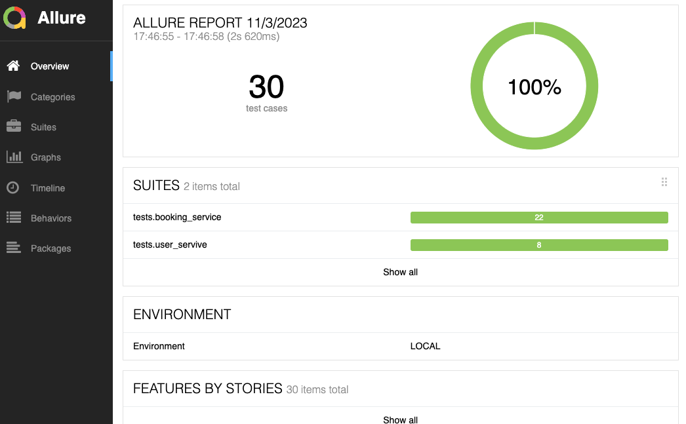
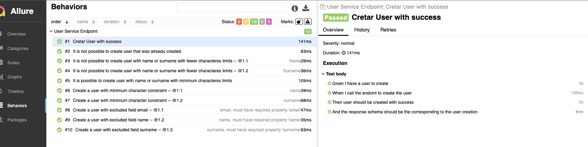

# API Task Service Testing

# Introduction

## How to run the tests?

To run the tests, you need to have `python` installed on your machine as well as `pip` for managing packages. After that, in the project's root directory(`api-testing/`), install all the required packages with the command:

```
pip install -r requirements.txt
```

After installing all the packages, you can execute the tests you desire using the `pytest` or `behave`. This allows you to run all the tests in the project, tests from a specific directory, or tests for a specific service, and so on. Examples:

```
pytest .
pytest tests/
pytest tests/user_servive/
```

or

```
behave tests_bdd/ --no-capture --define env=local
behave tests_bdd/features/user.feature --no-capture --define env=local
```

This command, by default, runs tests in the local environment. However, if you want to run tests in another environment, you can pass it as a parameter to `pytest` or `behave`, like this:

```
pytest --env qa tests/user_servive/
```

```
behave tests_bdd/features/user.feature --no-capture --define env=qa
```

Please note that you should check if the configuration file for the environment has been created in `utils/config`.

# Report

If you want to generate a report for the test execution, you can use Allure for this purpose. Just add `--alluredir=./path/to/folder` to the command, like this:

```
pytest --env local --alluredir=./allure-results tests/user_servive/
```

or

```
behave tests_bdd/ --no-capture --define env=local --format allure_behave.formatter:AllureFormatter -o allure-results
```

To view the results, you will need to have Allure installed. You can find installation instructions here: [Allure Get Started](https://docs.qameta.io/allure/#_get_started). After that, you can run Allure pointing it to the directory where the test results were saved:

```
allure serve allure-results/
```

If everything goes well, you should see a server running on localhost with the following page:

Pytest

Behave


<br></br>

# Code Updates in the Project?

Every time there are code updates to be made in the project, remember to run the command for static code analysis. If there are any violations or warnings, make sure to address and possibly correct them with the command:

```
pylint *
```
