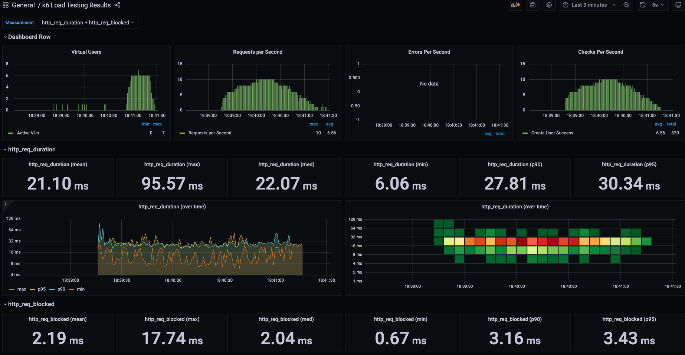
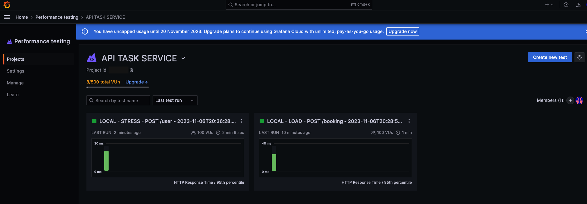
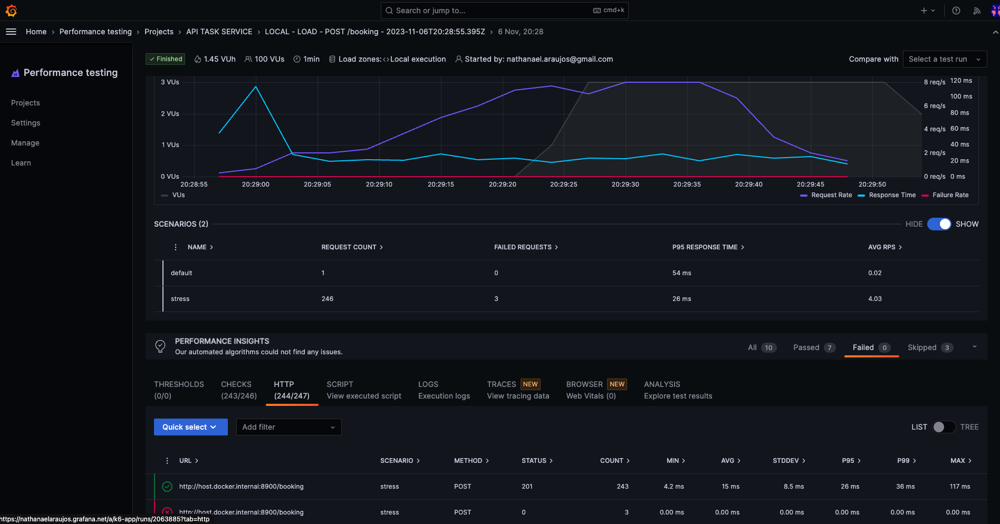

README.md

# Performance Testing

This is a performance testing project using k6.

## How to run the tests

Before of all, you need to have Docker installed on your machine, after the installation:

Navigate to the directory where you want to run the tests, for example, `performance-testing`.

1. Install project dependencies by running the command below; it will be used to view the real-time report.

```
docker-compose up -d influxdb grafana k6
```

2. Run the tests using the command below, look at this file to see if everything is ok with the test you want to run

```
./run-test.sh
```

If you prefer, you can run it directly with the following command:

```
docker-compose run --rm k6 run /scripts/get_all_users.js -e ENV=local -e TEST_TYPE=stress -e K6_OUT=influxdb=http://influxdb:8086/k6
```

You can access the address http://localhost:3000/d/k6/k6-load-testing-results to check the results. You should see a report like this in real-time:

Local Grafana



3. If you prefer, you can run the tests and report to K6 Grafana Cloud. (Remember to update the project Id of Grafana Cloud in `script/utils/data.js`)

```
docker-compose run --rm k6 login cloud -t <API_TOKEN>
docker-compose run --rm k6 run --out cloud /scripts/get_all_users.js -e ENV=local -e TEST_TYPE=stress -e K6_CLOUD_TOKEN=<API_TOKEN>
```

Grafana Cloud



